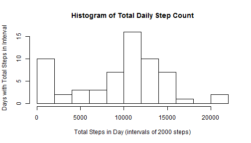
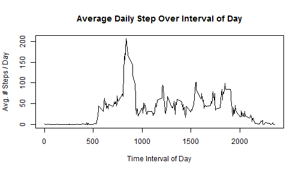
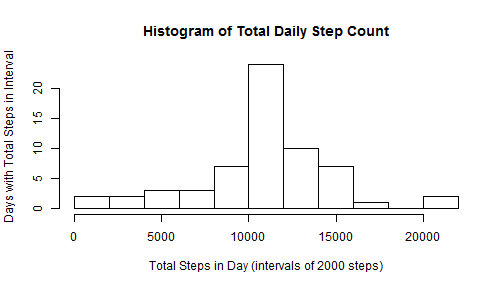
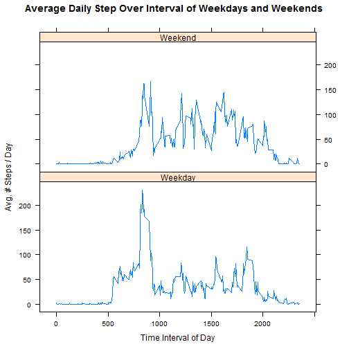

# Reproducible Research: Peer Assessment 1
#### Russell Allen - Monday, August 11, 2014


## Loading and preprocessing the data

This assignment utilizes data on personal movement collected via a device that "collects data at 5 minute intervals through out the day. The data consists of two months of data from an anonymous individual collected during the months of October and November, 2012 and include the number of steps taken in 5 minute intervals each day." - [per aissignment.](https://github.com/rdpeng/RepData_PeerAssessment1)


```r
originalSource <- "https://d396qusza40orc.cloudfront.net/repdata%2Fdata%2Factivity.zip";
fileName <- "activity.csv";
```

The data was originally downloaded from https://d396qusza40orc.cloudfront.net/repdata%2Fdata%2Factivity.zip as a zip file, which contained a single file named activity.csv.  This report is generated under the assumption that the activity.csv file is extracted and local to the working directory at the time of report generation.

1. Load the data for analysis by reading activity.csv


```r
originalData <- read.csv(fileName);
```

2. The unprocessed data is organized into three variables:
- Steps - The number of steps taken in that 5 minute interval.
- Date - The date that the 5 minute interval occurred on.
- Interval - The interval number within the date.  The number is actually composed of the hour (0-23) and the beginning minute of the interval.  For example, Two Thirty Seven PM is captured in the interval numbered 1435 as 14:35 is the 24-hour clock time stamp that begins the five minute interval containing 2:37PM.


```r
originalData[1000:1003,];
```

```
##      steps       date interval
## 1000     0 2012-10-04     1115
## 1001     0 2012-10-04     1120
## 1002   180 2012-10-04     1125
## 1003    21 2012-10-04     1130
```

3. Note, some data entries contain missing steps encoded as NA...


```r
sum(is.na(originalData$steps));  # Count number of NA step entries
```

```
## [1] 2304
```

... but date and interval are fully populated.


```r
sum(is.na(originalData$date), is.na(originalData$interval));
```

```
## [1] 0
```

4. In an effort to simplify the upcoming analysis, convert the data frame to a data table:


```r
library(data.table);
data <- data.table(originalData);
```
The remainder of the analysis will be performed against the `data` variable, while `originalData` will be retained without modification.


## What is mean total number of steps taken per day?

First, lets group the data by date, and then compute the sum of the steps within each date.

```r
totalStepsPerDay <- data[, sum(steps, na.rm =TRUE), by = "date"];
setnames(totalStepsPerDay, old = "V1", new = "totalSteps");  #Apply a nice column name
```

Rendered as a histogram, this shows the distribution of days according to their total number of steps.  Of note, the first interval of 0 to 2000 steps is occupied by 10 different days.  This is perhaps misleading because entries where the step counts were not reported (reported as NA) were treated as a step count of 0 for this step of the analysis.


```r
hist(totalStepsPerDay$totalSteps, breaks = 10, main = "Histogram of Total Daily Step Count", ylab = "Days with Total Steps in Interval", xlab = "Total Steps in Day (intervals of 2000 steps)");
```

 

A summary of total steps per day,

```r
summary(totalStepsPerDay$totalSteps)
```

```
##    Min. 1st Qu.  Median    Mean 3rd Qu.    Max. 
##       0    6780   10400    9350   12800   21200
```
yields a median value of 1.04 &times; 10<sup>4</sup> and a mean value of 9350 along with the min and max, and the 1st and 3rd quadrilles.  These values fit the histogram shown above.  For example, the 1st quartile is well below the median in comparison to the 3rd quartile, because of the number of 0 step days.


## What is the average daily activity pattern?

This time lets group data based on interval, and then compute the mean of the steps for each interval.  Thus, this is a mean of the number of steps taken in that interval across all days in the study.


```r
meanStepsPerInterval <- data[, mean(steps, na.rm =TRUE), by = "interval"];
setnames(meanStepsPerInterval, old = "V1", new = "meanSteps");  #Apply a nice column name
```

Rendered as a time series plot, this shows the average activity (in mean steps, Y axis) at each interval of the day (X axis).


```r
plot(x=meanStepsPerInterval$interval, y=meanStepsPerInterval$meanSteps, type = "l", main = "Average Daily Step Over Interval of Day", ylab = "Avg. # Steps / Day", xlab = "Time Interval of Day");
```

 

Note the distinct peak of activity visible in the plot.  This peak period of activity is identified via:


```r
maxMeanStepsPerIntervalRow <- which.max(meanStepsPerInterval$meanSteps);
meanStepsPerInterval[maxMeanStepsPerIntervalRow,];
```

```
##    interval meanSteps
## 1:      835     206.2
```

Thus we now know that the time interval 835 is the most active time interval of the day based on average steps per day, and that maximum average step count is 206.1698.


## Imputing missing values

In the first analysis of the mean total number of steps taken per day, the data points with missing step counts were removed from the calculations.  In this re-analysis, I will substitute missing values with the mean value of that interval across all days in the study.

Recall from the pre-processing that there are 2304 NA values in the `steps` column of `originalData`.  No other columns had missing values.  Thus there are 2304 missing values, each in a distinct row of `originalData`.

Lets create a new version of `data` where we will replace NA's with the mean as described above.  We'll do this by conditionally replacing the `steps` value with the `meanSteps` value from the prior analysis's `meanStepsPerInterval` table (at the same `interval` as the NA valued steps row.)

```r
fullData <- data[, steps := ifelse(is.na(steps), meanStepsPerInterval[meanStepsPerInterval$interval == interval]$meanSteps, steps)];
```

We now have a new data table that is equal to the original data table but with missing data filled in.

If we (re)render this as a histogram of the distribution of days according to their total number of steps, we can compare this histogram to that in the first analysis.


```r
totalStepsPerDayFull <- fullData[, sum(steps), by = "date"];
setnames(totalStepsPerDayFull, old = "V1", new = "totalSteps");  #Apply a nice column name
hist(totalStepsPerDayFull$totalSteps, breaks = 10, main = "Histogram of Total Daily Step Count", ylab = "Days with Total Steps in Interval", xlab = "Total Steps in Day (intervals of 2000 steps)");
```

 

A summary of total steps per day with full data,

```r
summary(totalStepsPerDayFull$totalSteps)
```

```
##    Min. 1st Qu.  Median    Mean 3rd Qu.    Max. 
##      41    9820   10800   10800   12800   21200
```
yields a median value of 1.08 &times; 10<sup>4</sup> and a mean value of 1.08 &times; 10<sup>4</sup>.  These values differ from the results of the first analysis, primarily in that the median value and mean are now identical whereas in the first analysis the medial value was significantly less than the mean.  This 'makes sense' in that NA values in the first analysis skewed the median significantly but were not included in the mean calculation.  Once this analysis set the missing values, then median more accurately reflected the center (mean) of the mass.

However, by setting the missing values to the mean for their interval, we have increased the frequency of days with an average number of steps.  In essence, the days with predominantly NA step counts have moved from being counted as 0 step days to the middle of the histogram.  This explains the apparent increase in days where the step count was average.


## Are there differences in activity patterns between weekdays and weekends?

In order to analyze the difference in activity pattern between weekend and weekdays, we need to annotate the data with a `typeOfDay` variable.  The values of this column will be either `Weekend` or `weekday` as indicated by the date.


```r
fullData[, typeOfDay := ifelse(weekdays(as.Date(date)) %in% c("Saturday", "Sunday"), "Weekend", "Weekday")]
```

```
##          steps       date interval typeOfDay
##     1: 1.71698 2012-10-01        0   Weekday
##     2: 0.33962 2012-10-01        5   Weekday
##     3: 0.13208 2012-10-01       10   Weekday
##     4: 0.15094 2012-10-01       15   Weekday
##     5: 0.07547 2012-10-01       20   Weekday
##    ---                                      
## 17564: 4.69811 2012-11-30     2335   Weekday
## 17565: 3.30189 2012-11-30     2340   Weekday
## 17566: 0.64151 2012-11-30     2345   Weekday
## 17567: 0.22642 2012-11-30     2350   Weekday
## 17568: 1.07547 2012-11-30     2355   Weekday
```

Now that the base data is annotated, we need to compute the mean within an interval across all days of the same type.


```r
meanStepsPerIntervalFull <- fullData[, mean(steps), by = c("typeOfDay", "interval")];
setnames(meanStepsPerIntervalFull, old = "V1", new = "meanSteps");  #Apply a nice column name
```

Now lets compare the activity using the same time series method previously used (average steps per interval of intervals of a day).  This time we will create one plot of the averages of `Weekday` days and a paired plot of the averages of `Weekend` days.


```r
library(lattice);
xyplot(meanSteps ~ interval | typeOfDay, meanStepsPerIntervalFull, layout = c(1,2), type = "l", main = "Average Daily Step Over Interval of Weekdays and Weekends", ylab = "Avg. # Steps / Day", xlab = "Time Interval of Day")
```

 

A visual inspection of the plot reveals that during the weekdays, participants took more steps on average earlier in the day followed by fewer steps throughout the day when compared to the average steps during weekend days.  On weekend days the average number of steps during the intervals of the day were comparatively uniform and slightly greater overall than the equivalent weekday intervals.


